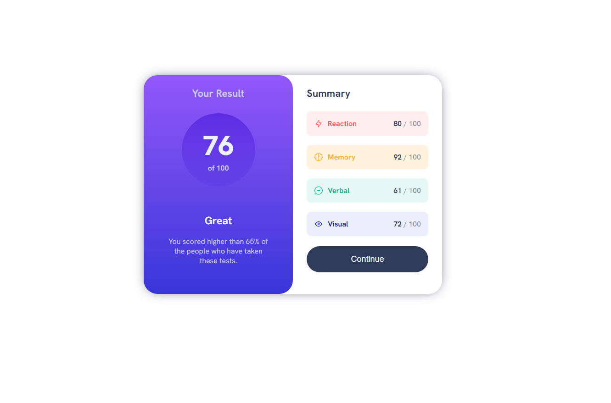
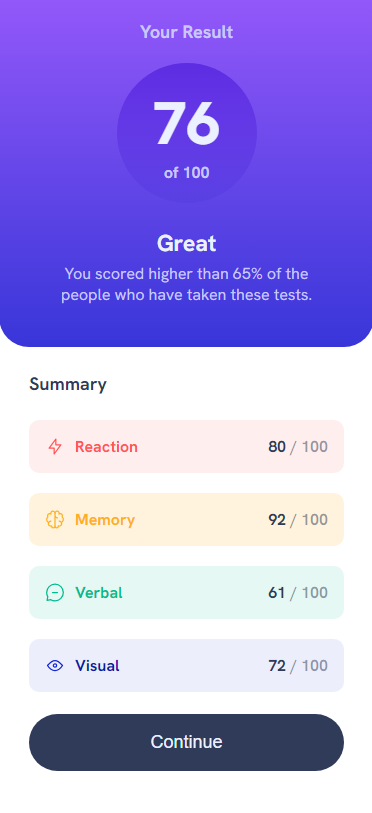

# Frontend Mentor - Results summary component solution
This is a solution to the "Results summary component" challenge on [Frontend Mentor](https://www.frontendmentor.io/challenges/results-summary-component-CE_K6s0maV).

## The challenge
Your challenge is building out this results summary component and getting it as close to the design as possible.

You can use any tools you like to help you complete the challenge. So if you've got something you'd like to practice, feel free to give it a go.

Your users should be able to:

- View the optimal layout for the interface depending on their device's screen size
- See hover and focus states for all interactive elements on the page
## Screenshots
#### 1440px

#### 375px

## 🔗 Links
- Solution URL: [click here](https://www.frontendmentor.io/solutions/results-summary-component-1sGg_g3kzW)
- Live URL: [click here](https://mateuszhofman.github.io/Results-summary-component.github.io/)
## Author

- Frontend Mentor: [@mateuszhofman](https://www.frontendmentor.io/profile/mateuszhofman)
- Linkedin: [@mateusz-hofman](https://www.linkedin.com/in/mateusz-hofman-b815502a8/)

